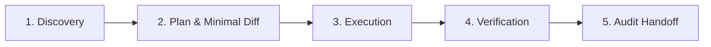
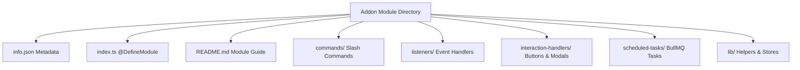

# 🤖 Lumi Addons — AI Agent Operating Specification

  
  
  

> **Operational Guidelines, Architectural Laws, and Verification Standards for AI Coding Assistants working on Lumi Addons.**

---

## 🔒 1. Core Architectural Laws

> [!IMPORTANT]
> All AI coding assistants MUST strictly enforce these five non-negotiable architectural laws when inspecting or editing code in this repository.

1. **Zero Cross-Module Import Law**:
   Addons must **NEVER** directly import code, types, or utilities from another addon module directory. Inter-module interaction occurs exclusively via Discord events, `@lumi/*` container services (`container.db.guildKV`, `container.redis`), or BullMQ task fire relays.

2. **`@DefineModule` Decorator Mandate**:
   Every addon entrypoint (`index.ts`) must export a module class annotated with the `@DefineModule` decorator declaring its unique module `name`, `displayName`, `emoji`, `version`, `description`, and `configSchema`.

3. **Database Access Law**:
   Addons MUST use `container.db.guildKV` (DatabaseService) for persistent storage. Direct raw SQL execution, custom Prisma schemas, or ad-hoc database client instances are strictly forbidden.

4. **Card UI System Enforcement**:
   Raw `EmbedBuilder` instantiations are strictly prohibited. All user-facing UI embeds must be rendered through card helpers from `#utilities/cards.js` or `BaseCommand` reply wrappers (`replySuccess`, `replyError`, `replyWarning`, `replyInfo`).

5. **GDPR Data Erasure Mandate**:
   Every addon that stores user-keyed state must implement the `deleteUserData(userId, requester)` handler on its module class. If no user data is stored, an explicit no-op comment must be documented in `deleteUserData`.

---

## 🛠️ 2. AI Operational Governance

### Task Execution Lifecycle

1. **Discovery**: Read target module `README.md`, `info.json`, `index.ts`, and sub-store directories before attempting code modifications.
2. **Planning & Minimal Diff**: Limit code modifications strictly to target scope. Avoid unnecessary refactoring or style drift.
3. **Execution**: Re-read files before editing. Use precise replacement tools (`replace_file_content` / `multi_replace_file_content`).
4. **Verification**: Always run `bun run typecheck` and `bun run lint` after code edits.
5. **Audit Handoff**: Document exact observations, logical steps, caveats, conclusions, and verification commands.

### Tool Safety Constraints

> [!WARNING]
> **Vendor Blacklist Rule**: AI agents must strictly blacklist and ignore 3rd-party vendor directories (`node_modules/`, `data/3rd-party-modules/`). Never edit vendor files or generated lockfiles directly.

- **Destructive Git Commands**: `git reset --hard`, `git push --force`, and `git clean -fd` are strictly prohibited.
- **Credential Protection**: Secrets, API tokens, and bot credentials must NEVER be logged or committed.

---

## 📐 3. Standard Addon Directory Anatomy

---

## 🧪 4. Verification Command Matrix

| Scope | Command | Expected Result |
| :--- | :--- | :--- |
| **Type Safety** | `bun run typecheck` | `0 errors` |
| **Lint & Formatting** | `bun run lint` | `0 lint warnings/errors` |
| **Local Link Setup** | `bun run setup` | `Symlinks established` |
