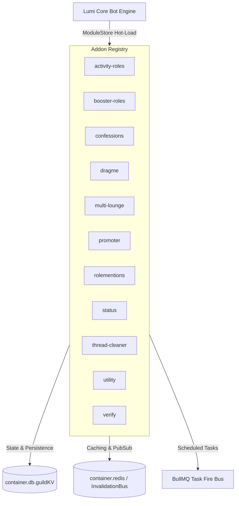

# 🧩 Lumi Addons Ecosystem

<p align="center">
  
  
  
  
  
</p>

> **Hot-loadable, sandboxed, and zero-downtime extension modules for the [Lumi Discord Platform](https://github.com/rebizzz/lumi).**

---

## 🌟 Overview

**Lumi Addons** provides a modular plugin ecosystem designed to extend your Discord bot dynamically with zero downtime. Each addon is an isolated plugin loaded via Sapphire framework sub-stores and instantly configurable through `/config` or interactive Discord controls.

> [!NOTE]
> All official addons obey the **Zero Cross-Module Import Law**, utilizing shared `@lumi/*` container services (`container.db.guildKV`, Redis key invalidations, and BullMQ relays) for maximum stability and modularity.

---

## 🗺️ Addon Module Catalog & Sitemap

| Addon Module | Category | Description | Hot Loadable | Configuration |
| :--- | :--- | :--- | :---: | :--- |
| 🎮 [`activity-roles`](./activity-roles) | Engagement | Auto-assigns roles based on Discord Rich Presence & custom status | ✅ | `/activityroles` |
| 🎨 [`booster-roles`](./booster-roles) | Community | Custom booster role creation, color picker, max shares, and grace cleanup | ✅ | `/config` |
| 🕊️ [`confessions`](./confessions) | Moderation | Anonymous confessions system with thread discussions and log masking | ✅ | `/config` |
| 🫳 [`dragme`](./dragme) | Voice | Consent-based voice move requests with interactive button prompts | ✅ | `/config` |
| 🛋️ [`multi-lounge`](./multi-lounge) | Dynamic Voice | Auto-scaling dynamic voice channels with custom bitrates and limits | ✅ | `/config` |
| 📣 [`promoter`](./promoter) | Rewards | Auto-rewards members featuring server tags or vanity links in custom status | ✅ | `/config` |
| 🛡️ [`rolementions`](./rolementions) | Protection | Mention tracking, ghost-ping logging, and sensitive role AutoMod protection | ✅ | `/config` |
| 🔁 [`status`](./status) | Core | Global rotating bot presence and dynamic activity switcher | ✅ | `/status` |
| 🧹 [`thread-cleaner`](./thread-cleaner) | Utility | Automated archiver, auto-locker, and stale thread cleanup scheduler | ✅ | `/config` |
| ⚙️ [`utility`](./utility) | Utility | Essential server utilities (auto-translation, emoji stealer) | ✅ | Dynamic |
| ✅ [`verify`](./verify) | Security | Interactive Captcha verification with timeout handling & raid protection | ✅ | `/config` |

---

## 🏗️ Architecture Overview



---

## 📥 Installation & Activation

Lumi features a built-in dynamic downloader and hot-reloading module manager. Addons can be installed directly without restarting the bot process:

```bash
# 1. Register the official Lumi Addons repository in Lumi
,repo add lumi-addons https://github.com/rebizzz/lumi-addons.git

# 2. Download and activate target modules
,download lumi-addons activity-roles
,download lumi-addons booster-roles
,download lumi-addons confessions
,download lumi-addons verify
```

> [!TIP]
> Installed addons automatically register commands, listeners, interaction handlers, and scheduled tasks in Sapphire stores without requiring a bot restart.

---

## 💻 Local Development & Verification

To develop or contribute to Lumi Addons locally:

```bash
# 1. Clone alongside the main Lumi Core repository
git clone https://github.com/rebizzz/lumi ../lumi
git clone https://github.com/rebizzz/lumi-addons .

# 2. Run setup script to link local dependencies
bun run setup

# 3. Validate TypeScript types & code style
bun run typecheck
bun run lint
```

---

## 📄 License

Distributed under the **GPL-3.0 License**. See [`LICENSE`](./LICENSE) for full details.
