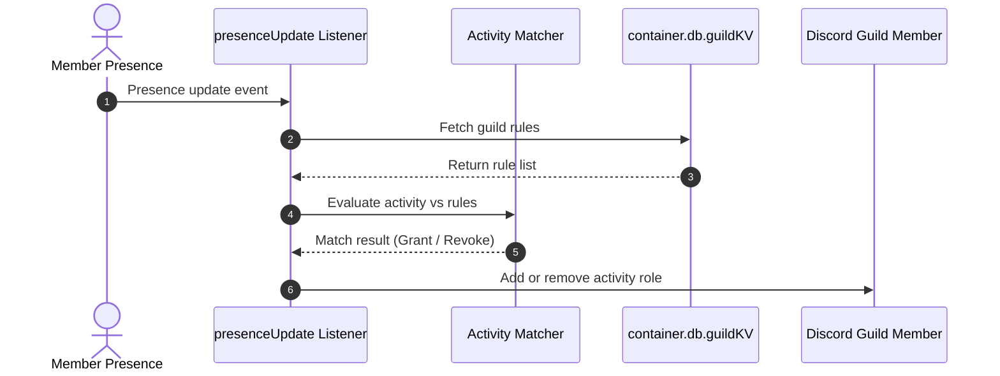

# 🎮 Activity Roles Addon

<p align="center">
  
  
  
</p>

> **Presence-based dynamic role automation for the Lumi Discord platform.**

---

## 🌟 Overview

The **Activity Roles** addon automatically assigns roles to server members based on their active Discord presence or custom status. Whether members are playing a specific game, streaming on Twitch, listening to Spotify, or wearing custom status text, Activity Roles handles automatic assignment and revocation when the activity stops.

---

## ✨ Features

- **Full Presence Support**: Detects `Playing`, `Streaming`, `Listening`, `Watching`, `Custom`, and `Competing` activity types.
- **Substring & Text Matching**: Flexible string matching rules per activity rule.
- **Automated Revocation**: Strips assigned roles immediately when members change or clear their status.
- **Durable KV Persistence**: Configured mappings are safely stored per guild via `container.db.guildKV`.

---

## 📥 Installation & Activation

Install the module using Lumi's built-in dynamic downloader:

```bash
# Download and hot-load the module
,download lumi-addons activity-roles
```

> [!NOTE]
> Requiring the privileged **Presence Intent** in Discord Developer Portal is mandatory for presence update tracking.

---

## ⚙️ Configuration Options

Activity Roles mappings are stored dynamically per guild via `/activityroles` commands:

| Mapping Attribute | Type | Description |
| :--- | :--- | :--- |
| `type` | `Enum` | Activity type (`Playing`, `Streaming`, `Listening`, `Watching`, `Custom`, `Competing`). |
| `match` | `String` | Text or substring to match against activity name or custom status message. |
| `role` | `Role` | Discord role to assign when the rule condition is satisfied. |

---

## 💻 Commands & Usage

All commands require **Manage Roles** permission:

| Command | Subcommand | Arguments | Description |
| :--- | :--- | :--- | :--- |
| `/activityroles` | `add` | `type: ActivityType`, `match: string`, `role: Role` | Create a new presence-to-role rule mapping. |
| `/activityroles` | `remove` | `role: Role` | Remove an existing activity role mapping. |
| `/activityroles` | `list` | *None* | Display all configured activity role rules for this server. |

---

## 📡 Events & Listeners

- **`presenceUpdate` Listener** (`listeners/presenceUpdate.ts`):
  Evaluates incoming presence updates against configured rules in `lib/store.ts` using `lib/matcher.ts`. Dynamically grants roles when matching criteria are met and removes roles when presence changes.

- **GDPR Standard**:
  This module only stores guild-level mapping configurations. No user-specific data is persisted.

---

## 🎨 Code Examples

### Event Flow Architecture



### TypeScript Mapping Example

```ts
import { matchActivity } from "./lib/matcher.js";

// Example activity matching check
const isMatch = matchActivity({
  ruleType: "Playing",
  ruleMatch: "VALORANT",
  userActivities: [
    { type: 0, name: "VALORANT", state: "In Game" }
  ]
});

console.log(`Activity match status: ${isMatch}`); // true
```
