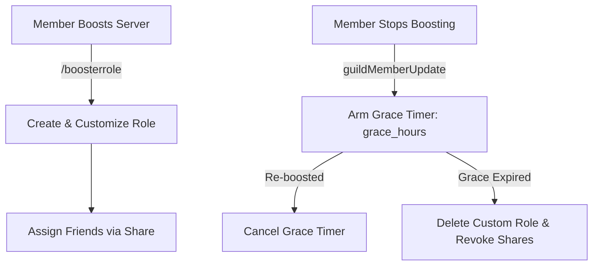

# 🎨 Booster Roles Addon

<p align="center">
  
  
  
</p>

> **Interactive custom role panel, share management, and grace period cleanup for server boosters.**

---

## 🌟 Overview

The **Booster Roles** addon grants Server Boosters (and custom qualifying role holders) full self-serve control over personal custom roles. Boosters can create, rename, recolor, and share their custom role with friends via an ephemeral interactive panel. When boosting status lapses, an automated grace-period scheduler cleans up unused roles seamlessly.

---

## ✨ Features

- **Interactive Control Panel**: Self-serve buttons and modals for creation, renaming, color selection, and role deletion.
- **Role Sharing Engine**: Boosters can share their custom role with up to `max_shares` friends.
- **Anchor Positioning**: Automatically creates and anchors custom roles directly underneath a configured role.
- **Grace Period Cleanup**: Delays role deletion after boost loss by `grace_hours` to allow boost renewals.
- **Automatic Reconcile Sweeper**: Periodic background task cleans up orphaned roles, left members, or out-of-band role deletions.
- **Admin Moderation Tools**: Full admin command suite for statistics, audits, role deletion, and blacklist enforcement.

---

## 📥 Installation & Activation

Install the addon via Lumi's dynamic downloader:

```bash
# Download and activate booster-roles
,download lumi-addons booster-roles
```

Configure module options in Discord with `/config` under **Booster Roles**.

---

## ⚙️ Configuration Options

| Option | Type | Default | Description |
| :--- | :--- | :---: | :--- |
| `booster_role_ids` | `Role List` | *Empty* | Role IDs granting access. Empty defaults to native Discord boost status. |
| `anchor_role_id` | `Role` | *None* | Target role below which custom roles are positioned. |
| `showcase_channel_id` | `Channel` | *None* | Optional channel where new custom roles are announced. |
| `log_channel_id` | `Channel` | *None* | Optional channel for moderation audit log entries. |
| `max_shares` | `Number` | `3` | Maximum number of friends a booster can share their role with. |
| `grace_hours` | `Number` | `24` | Hours to wait after a boost ends before removing the custom role. |
| `name_max_length` | `Number` | `32` | Maximum character length allowed for custom role names. |

---

## 💻 Commands & Usage

### Member Command
- `/boosterrole` — Open the private interactive booster role management panel.

### Administrator Commands (`/boosterrole-admin`)
| Subcommand | Arguments | Description |
| :--- | :--- | :--- |
| `stats` | *None* | Display server custom role, active share, and blacklist statistics. |
| `list` | *None* | List all active custom booster roles and their current owners. |
| `info` | `user: Member` | View detailed custom role information and share recipients for a member. |
| `delete` | `user: Member`, `[reason: string]` | Force-delete a member's custom role and clean up assigned shares. |
| `blacklist` | `action: add/remove/list`, `[user: Member]` | Manage member blacklists from using custom booster roles. |

---

## 📡 Events & Listeners

- **`guildMemberUpdate` Listener** (`listeners/guildMemberUpdate.ts`):
  Detects boost removal and triggers grace-period timers via BullMQ task fire bus (`booster-grace-delete`).
- **Scheduled Tasks**:
  - `booster-grace-delete`: Broadcast task executing delayed role removal upon grace expiry.
  - `booster-roles-reconcile`: 12-hour periodic background sweep healing configuration or member drift.
- **GDPR Standard**:
  `deleteUserData(userId)` purges owner custom roles, blacklist records, and share entries across all guilds.

---

## 🎨 Code Examples

### Lifecycle Flow



### Module Configuration Schema

```json
{
  "anchor_role_id": "987654321012345678",
  "log_channel_id": "112233445566778899",
  "max_shares": 3,
  "grace_hours": 24,
  "name_max_length": 32
}
```
