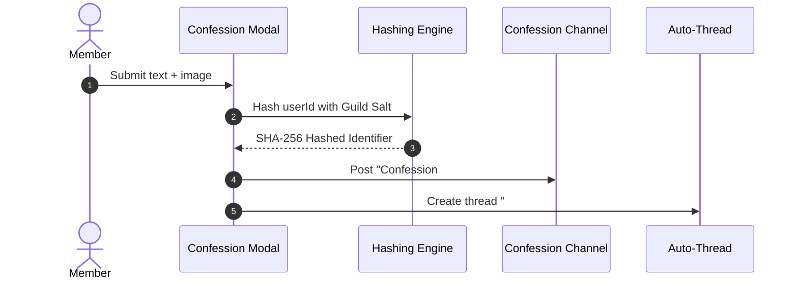

# 🕊️ Confessions Addon

<p align="center">
  
  
  
</p>

> **Cryptographically anonymous confession system with threads, replies, and moderator tools.**

---

## 🌟 Overview

The **Confessions** addon enables server members to submit anonymous confessions via modal forms. Submissions are published as sequentially numbered cards (`Confession #N`). Members can reply anonymously inside auto-created threads (`#N.k`), while moderators maintain full safety and ban controls using salted cryptographic hashes — without ever unmasking author identities.

---

## ✨ Features

- **Cryptographic Anonymity**: User IDs are hashed per-guild (`SHA-256(guild_salt : userId)`). User identities are never stored in cleartext.
- **Auto-Threading**: Optional automatic thread creation under each posted confession for organized anonymous discussions.
- **Anonymous Replies**: Members can reply anonymously via buttons or `/reply` commands.
- **Media Re-hosting**: Optional media re-hosting channel strips metadata and generates safe image URLs.
- **Per-Author Cooldowns**: Configurable cooldowns limit submission frequency per hashed author.
- **Moderation & Safety Controls**: Moderators can ban problematic author hashes, delete confessions, and receive user report logs.

---

## 📥 Installation & Activation

Install the module via Lumi's dynamic downloader:

```bash
# Download and activate confessions
,download lumi-addons confessions
```

Configure `confession_channel_id` and options via `/config` under **Confessions**.

---

## ⚙️ Configuration Options

| Option | Type | Default | Description |
| :--- | :--- | :---: | :--- |
| `confession_channel_id` | `Channel` | *Required* | Text channel where confessions are published. |
| `log_channel_id` | `Channel` | *None* | Audit channel for hashed moderation ban and delete logs. |
| `report_channel_id` | `Channel` | *None* | Channel where user report flags land. |
| `report_ping_role_id` | `Role` | *None* | Role pinged when a confession or reply is reported. |
| `media_channel_id` | `Channel` | *None* | Private channel used for re-hosting attachments to strip metadata. |
| `auto_thread` | `Boolean` | `true` | Open a thread under each confession card for replies. |
| `allow_attachments` | `Boolean` | `true` | Permit image attachment uploads in confessions and replies. |
| `cooldown_minutes` | `Number` | `5` | Required delay (in minutes) between confessions by the same author. |

---

## 💻 Commands & Usage

### User Commands
- `/confess` — Open modal form to submit an anonymous confession.
- `/reply` — Submit an anonymous reply to a specific confession or thread.

### Moderator Commands (`/confessmod`)
| Subcommand | Arguments | Description |
| :--- | :--- | :--- |
| `ban` | `number: Integer` | Ban the anonymous author of confession #N from future submissions. |
| `unban` | `target: string` | Lift a ban using a confession number or author hash. |
| `list` | *None* | List all active banned author hashes in the guild. |
| `delete` | `number: Integer`, `[reason: string]` | Delete confession card #N and its associated discussion thread. |

---

## 📡 Events & Listeners

- **Modal & Button Interaction Handlers** (`interaction-handlers/modals.ts`):
  Processes `/confess` modal submissions, computes salted hashes, re-hosts media attachments, and manages auto-threads.
- **GDPR Standard**:
  `deleteUserData(userId)` purges author hashes, active cooldowns, bans, and reply records across all guild databases.

---

## 🎨 Code Examples

### Anonymity & Submission Pipeline



### Configuration Snippet

```json
{
  "confession_channel_id": "100000000000000001",
  "log_channel_id": "100000000000000002",
  "auto_thread": true,
  "allow_attachments": true,
  "cooldown_minutes": 5
}
```
