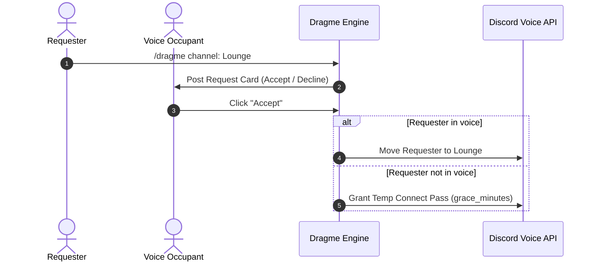

# 🫳 Drag Me Addon

<p align="center">
  
  
  
</p>

> **Consent-based voice move requests approved interactively by channel occupants.**

---

## 🌟 Overview

The **Drag Me** addon lets members request to join locked or populated voice channels. Instead of needing admin permissions to drag users, existing channel occupants receive an interactive card with **Accept** and **Decline** buttons. Requesters are moved automatically upon approval or granted temporary connect passes.

---

## ✨ Features

- **Consent-Based Move Requests**: Requires explicit approval from current voice channel members before moving users.
- **Interactive Button UI**: Occupants accept or deny requests directly from an interactive message card.
- **Connect Pass Support**: If approved while the requester is not in voice, grants a temporary connect pass auto-revoked after `grace_minutes`.
- **Hidden Channel Support**: Optionally grants temporary `ViewChannel` / `Connect` permissions for private channels (`grant_hidden_perms`).
- **Voice Cleanup Listener**: Automatically revokes temporary permissions as soon as the user leaves the voice channel.
- **Role Blacklisting**: Exclude specified role IDs from creating drag requests.

---

## 📥 Installation & Activation

Install the addon via Lumi's dynamic downloader:

```bash
# Download and activate dragme
,download lumi-addons dragme
```

Configure `request_channel_id` and options via `/config` under **Drag Me**.

---

## ⚙️ Configuration Options

| Option | Type | Default | Description |
| :--- | :--- | :---: | :--- |
| `request_channel_id` | `Channel` | *Required* | Text channel where drag requests are posted and triggered. |
| `timeout_minutes` | `Number` | `5` | Minutes before an unanswered drag request automatically expires. |
| `grace_minutes` | `Number` | `10` | Duration (minutes) of a temporary connect pass for accepted offline requesters. |
| `blacklist_role_ids` | `Role List` | *Empty* | Role IDs prohibited from creating drag requests. |
| `grant_hidden_perms` | `Boolean` | `true` | Temporarily grant Connect/View permissions for hidden channels. |

---

## 💻 Commands & Usage

### User Commands
- `/dragme [channel: VoiceChannel]` — Request to join a specific voice channel.
- *Mention Trigger*: Post a user mention or user ID in `request_channel_id` to request joining that user's current voice channel.

### Administrator Commands (`/dragme-admin`)
- `/dragme-admin active` — View all pending voice drag requests across the server.
- `/dragme-admin clear` — Force-clear all active voice drag requests and temporary perms.

---

## 📡 Events & Listeners

- **`voiceStateUpdate` Listener** (`listeners/voiceStateUpdate.ts`):
  Monitors channel departures and revokes temporary permissions when users leave target voice channels.
- **Scheduled Tasks**:
  - `dragme-expire`: Unicast task expiring unanswered requests after `timeout_minutes`.
  - `dragme-revoke`: Unicast task revoking temporary connect passes after `grace_minutes`.
- **GDPR Standard**:
  `deleteUserData(userId)` cancels any active requests or temp permissions associated with the user.

---

## 🎨 Code Examples

### Request & Approval Workflow



### Configuration Snippet

```json
{
  "request_channel_id": "109876543210987654",
  "timeout_minutes": 5,
  "grace_minutes": 10,
  "grant_hidden_perms": true
}
```
