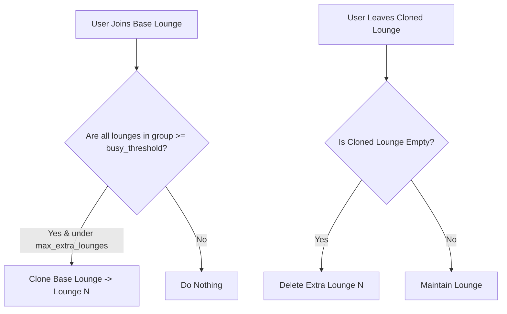

# 🛋️ Multi Lounge Addon

<p align="center">
  
  
  
</p>

> **Auto-scaling dynamic voice channels with automated expansion and cleanup.**

---

## 🌟 Overview

The **Multi Lounge** addon keeps your Discord voice channels clean and scalable. Server admins designate one or more **base** voice channels. When every lounge in a group fills up to the configured busy threshold, Multi Lounge automatically clones the base channel to create an extra lounge. When extra lounges empty, they are deleted automatically — ensuring there is always an open lounge without creating dead channel clutter.

---

## ✨ Features

- **Independent Base Scaling**: Each configured base channel scales its own group independently.
- **Full Settings Cloning**: Cloned channels inherit category, permissions, bitrate, and user limits from the base channel.
- **Contiguous Numbering**: Name templates dynamically assign the lowest available integer (`Lounge 1`, `Lounge 2`). Gaps are automatically backfilled.
- **Anti-Churn Cooldown**: Built-in creation cooldown prevents API rate limits during rapid join/leave bursts.
- **Reconciliation Engine**: Background reconciler heals missing or orphaned voice channels across bot restarts.

---

## 📥 Installation & Activation

Install the addon via Lumi's dynamic downloader:

```bash
# Download and activate multi-lounge
,download lumi-addons multi-lounge
```

Configure `base_channel_ids` via `/config` under **Multi Lounge**.

---

## ⚙️ Configuration Options

| Option | Type | Default | Description |
| :--- | :--- | :---: | :--- |
| `base_channel_ids` | `Channel List` | *Required* | Comma-separated base voice channel IDs to expand dynamically. |
| `busy_threshold` | `Number` | `2` | Number of occupants required per lounge before expanding. |
| `max_extra_lounges` | `Number` | `5` | Upper limit on bot-created extra channels per base. |
| `name_template` | `String` | `"Lounge {n}"` | Naming format for cloned lounges; `{n}` resolves to lounge number. |
| `cooldown_seconds` | `Number` | `10` | Minimum delay (seconds) between channel creations per base. |

---

## 💻 Commands & Usage

### Moderator Command
- `/lounge stats` — View real-time voice lounge occupancy, lifetime created/removed counts, and peak concurrent voice metrics.

---

## 📡 Events & Listeners

- **`voiceStateUpdate` Listener** (`listeners/voiceStateUpdate.ts`):
  Coalesces voice join, move, and leave events to execute dynamic scaling passes across base groups.
- **Scheduled Tasks**:
  - `multi-lounge-reconcile`: Broadcast task running periodic background sweeps to clean orphaned empty lounges.
- **GDPR Standard**:
  This module stores only channel IDs and aggregate performance metrics. No user data is stored.

---

## 🎨 Code Examples

### Dynamic Scaling Logic



### Module Configuration Example

```json
{
  "base_channel_ids": ["223344556677889900"],
  "busy_threshold": 2,
  "max_extra_lounges": 5,
  "name_template": "Lounge {n}",
  "cooldown_seconds": 10
}
```
