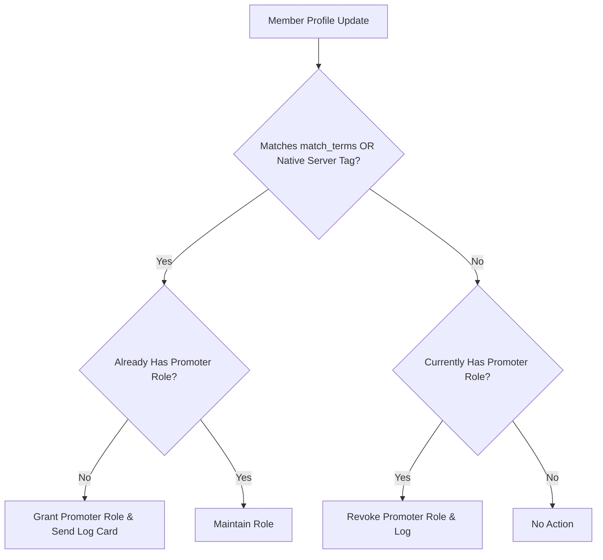

# 📣 Promoter Addon

<p align="center">
  
  
  
</p>

> **Automated role rewards for members advertising your server in custom statuses or native server tags.**

---

## 🌟 Overview

The **Promoter** addon automatically rewards members who support your community by featuring custom vanity invites, server text, or the native **Server Tag** in their Discord profile. When members add qualifying text to their status, Promoter grants them a designated reward role, and automatically revokes it if the status is removed.

---

## ✨ Features

- **Dual Detection Signals**:
  - **Custom Status Match**: Scans custom status text for configured terms (e.g. `.gg/lumi`, `LUMI`).
  - **Native Server Tag**: Automatically grants the role to members displaying the server's official tag (`detect_server_tag`).
- **Real-Time Presence Tracking**: Immediately evaluates status changes on incoming `presenceUpdate` events.
- **Self-Healing Sweeper**: Periodic sweep (`sweep_interval_minutes`) reconciles missed presence events and offline members.
- **Interactive Verification Card**: `/promoter panel` posts a persistent embed with a **Check My Status** button for self-service verification.
- **Event Audit Logging**: Posts rich audit cards when promoter roles are granted or revoked.

---

## 📥 Installation & Activation

Install the module via Lumi's dynamic downloader:

```bash
# Download and activate promoter
,download lumi-addons promoter
```

> [!IMPORTANT]
> The **Presence Intent** must be enabled in your Discord Developer Portal application settings.

---

## ⚙️ Configuration Options

| Option | Type | Default | Description |
| :--- | :--- | :---: | :--- |
| `promoter_role_id` | `Role` | *Required* | Role granted while a member actively advertises the server. |
| `log_channel_id` | `Channel` | *None* | Text channel for grant and revoke event notification cards. |
| `match_terms` | `String List` | *Empty* | Comma-separated terms to match in custom statuses (e.g. `.gg/lumi, LUMI`). |
| `detect_server_tag` | `Boolean` | `true` | Also grant role to members displaying the server's native tag. |
| `sweep_interval_minutes` | `Number` | `30` | Interval (minutes) for background self-healing member sweeps. |

---

## 💻 Commands & Usage

### Administrator Command
- `/promoter panel` — Post an interactive verification panel with a **Check My Status** button.

### Moderator Command
- `/promoter stats` — Display all-time grant, revoke, and active promoter statistics.

---

## 📡 Events & Listeners

- **`presenceUpdate` Listener** (`listeners/presenceUpdate.ts`):
  Evaluates real-time custom status changes and updates role assignments.
- **Scheduled Tasks**:
  - `promoter-sweep`: Broadcast task executing periodic background sweeps across cached members.
- **GDPR Standard**:
  This module stores aggregate grant/revoke metrics. No per-user rows are stored.

---

## 🎨 Code Examples

### Promoter Evaluation Architecture



### Module Configuration Example

```json
{
  "promoter_role_id": "334455667788990011",
  "log_channel_id": "445566778899001122",
  "match_terms": [".gg/lumi", "LUMI"],
  "detect_server_tag": true,
  "sweep_interval_minutes": 30
}
```
