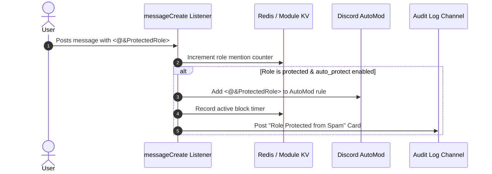

# 🛡️ Role Mentions Addon

<p align="center">
  
  
  
</p>

> **Role mention tracking, ghost-ping logging, and native Discord AutoMod role protection.**

---

## 🌟 Overview

The **Role Mentions** addon monitors role pings across your server, tracks daily mention analytics, catches ghost pings, and automatically protects sensitive roles from mention spam using native Discord AutoMod keyword rules.

---

## ✨ Features

- **Daily Mention Analytics**: Records per-role mention counters in Redis; automatically resets daily at 00:00 UTC.
- **AutoMod Protection**: Automatically blocks future pings of protected roles via managed AutoMod rules when triggered.
- **Ghost-Ping Detection**: Detects when role mention messages are deleted shortly after posting and logs ghost-ping details.
- **Manual Role Blocks**: On-demand temporary or permanent mention blocking for specific roles (`rp block`).
- **Safe Audit Logs**: Posts mention activity to the log channel with mentions suppressed (`allowedMentions: { parse: [] }`).

---

## 📥 Installation & Activation

Install the module using Lumi's dynamic downloader:

```bash
# Download and activate rolementions
,download lumi-addons rolementions
```

Configure log channels and options via `/config` under **Role Mentions**.

> [!NOTE]
> The bot requires the **Manage Server** permission to create and update Discord AutoMod rules.

---

## ⚙️ Configuration Options

| Option | Type | Default | Description |
| :--- | :--- | :---: | :--- |
| `log_channel_id` | `Channel` | *None* | Text channel where mention stats and protection logs are posted. |
| `auto_protect` | `Boolean` | `true` | Automatically block protected roles when pinged in chat. |
| `default_duration` | `Number` | `120` | Default protection block duration (minutes) when none is specified. |

---

## 💻 Commands & Usage

### Mention Statistics Commands (`/rolementions` or prefix `,rm`)
| Command | Arguments | Description |
| :--- | :--- | :--- |
| `rm stats` | `[role: Role]` | View today's mention count for all roles or a specific role. |
| `rm top` | `[limit: 1-25]` | Display the most-mentioned roles in the server today. |
| `rm reset` | *None* | *(Admin)* Reset today's mention counters manually. |

### Protection Management Commands (`/roleprotect` or prefix `,rp`)
| Command | Arguments | Description |
| :--- | :--- | :--- |
| `rp add` | `role: Role`, `[duration: string]` | Protect a role from mention spam (e.g. `90m`, `2h`, `1d`). |
| `rp remove` | `role: Role` | Remove a role from the auto-protection list. |
| `rp list` | *None* | Display all protected roles and active AutoMod blocks. |
| `rp block` | `role: Role`, `[duration: string]` | Immediately block mentions of a role via AutoMod. |
| `rp unblock` | `role: Role` | Lift an active mention block ahead of schedule. |

---

## 📡 Events & Listeners

- **`messageCreate` Listener** (`listeners/messageCreate.ts`):
  Scans incoming messages for raw role mention tags (`<@&roleId>`) and updates Redis daily counters.
- **`messageDelete` Listener** (`listeners/messageDelete.ts`):
  Identifies deleted messages containing role mentions to log ghost-ping alerts.
- **Scheduled Tasks**:
  - `rolementions-reset-daily`: Daily midnight cron task resetting mention counters.
- **GDPR Standard**:
  Counters and blocks are keyed by role ID. No per-user data is stored.

---

## 🎨 Code Examples

### Protection Pipeline Architecture



### Module Configuration Example

```json
{
  "log_channel_id": "556677889900112233",
  "auto_protect": true,
  "default_duration": 120
}
```
