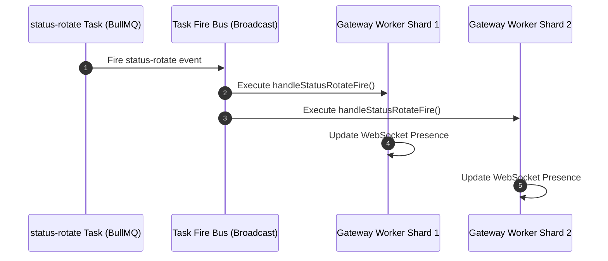

# 🔁 Status Rotator Addon

<p align="center">
  
  
  
</p>

> **Global rotating bot presence and activity manager for Lumi cluster sharding.**

---

## 🌟 Overview

The **Status Rotator** addon manages global, rotating bot activity presences across all connected Discord shards. Bot administrators can define custom status messages with dynamic placeholders (`{guilds}`, `{users}`, `{ping}`), set activity types, and configure rotation timers.

---

## ✨ Features

- **Dynamic Placeholders**: Interpolates real-time stats into status text:
  - `{guilds}` — Total servers connected.
  - `{users}` — Total user count across guilds.
  - `{ping}` — Current gateway ping latency.
- **Activity Types**: Supports `Playing`, `Streaming`, `Listening`, `Watching`, `Competing`, and `Custom` presences.
- **Distributed Shard Broadcasting**: Uses broadcast task fire relays (`status-rotate`) to synchronize presence updates across multi-process gateway shards.
- **Owner Control**: Restricted strictly to Bot Owners for security.

---

## 📥 Installation & Activation

Install the module via Lumi's dynamic downloader:

```bash
# Download and activate status rotator
,download lumi-addons status
```

> [!NOTE]
> All `/status` commands require **Bot Owner** permission. Settings apply globally across the bot instance.

---

## ⚙️ Configuration Options

Configured globally via `/status` owner commands and persisted in `global` module KV store:

| Parameter | Type | Default | Description |
| :--- | :--- | :---: | :--- |
| `interval` | `String` | `60s` | Rotation frequency (e.g., `30s`, `5m`, `1h`). |
| `enabled` | `Boolean` | `true` | Global rotation state toggle. |
| `entries` | `Array` | `[]` | List of status rotation entries (text, activity type, status state). |

---

## 💻 Commands & Usage

All commands require **Bot Owner** privileges:

| Command | Arguments | Description |
| :--- | :--- | :--- |
| `/status add` | `text: string`, `[type: ActivityType]`, `[presence: Online/Idle/DND]` | Add a new rotating status entry. |
| `/status remove` | `id: string` | Remove a status entry by ID. |
| `/status list` | *None* | View all configured rotating status entries. |
| `/status rotate` | *None* | Force an immediate rotation to the next status entry. |
| `/status interval` | `duration: string` | Update rotation timer interval (e.g. `30s`, `2m`). |
| `/status toggle` | *None* | Pause or resume automatic status rotation. |
| `/status preview` | *None* | Test placeholder rendering for active statuses. |

---

## 📡 Events & Listeners

- **Scheduled Tasks**:
  - `status-rotate`: Broadcast task firing on configured intervals. Each worker node applies interpolated presences to its local WebSocket sharding connections.
- **GDPR Standard**:
  `deleteUserData(userId)` replaces any `addedBy: userId` metadata in stored status entries with `"deleted"`.

---

## 🎨 Code Examples

### Rotation Broadcast Architecture



### Example Status Entry Configuration

```json
{
  "text": "Watching over {guilds} servers | {users} members",
  "type": "Watching",
  "presence": "online"
}
```
