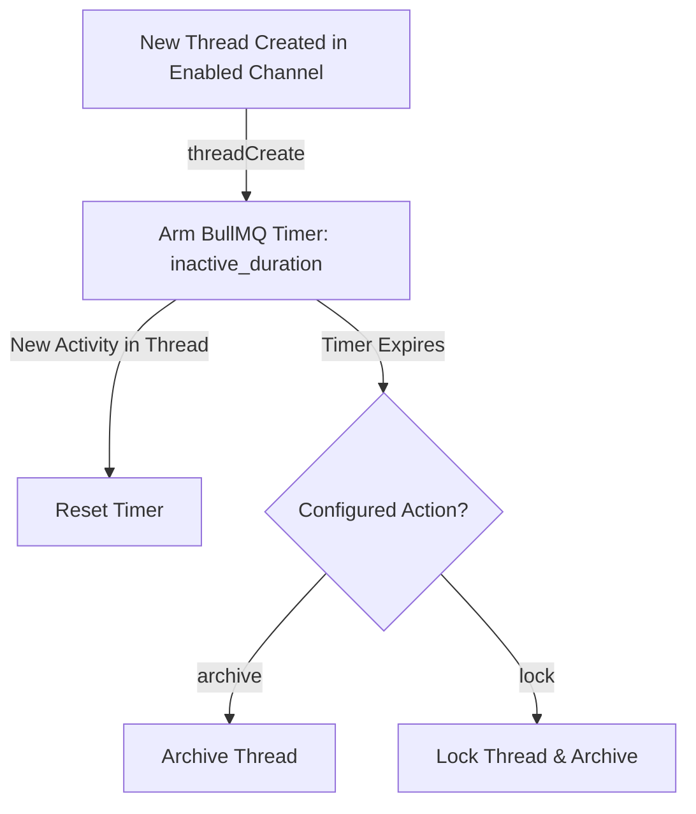

# 🧹 Thread Cleaner Addon

<p align="center">
  
  
  
</p>

> **Automated thread archiving, locking, and admin bulk cleanup sweeper.**

---

## 🌟 Overview

The **Thread Cleaner** addon keeps your server's text channels free from inactive thread clutter. It operates through automated inactivity timers on new threads and provides administrators with an interactive bulk sweep tool to audit, clean, or strip members from existing threads.

---

## ✨ Features

- **Automated Inactivity Scheduler**: Automatically schedules one-shot archiving or locking tasks when threads are created in target channels.
- **Persistent Redis Timers**: Cleanup jobs are keyed by thread ID (`thread-cleaner-task`), surviving bot restarts idempotently.
- **Configurable Actions**: Choose between soft archiving (`archive`) or locking threads (`lock`).
- **Interactive Admin Bulk Sweep**: `/thread-cleaner sweep` processes existing active or archived threads with interactive confirmation prompts.
- **Member Stripping**: Optional flag to remove members from inactive threads to reduce sidebar noise.
- **Safety Thresholds**: Bulk sweeps are safely bounded to a maximum of 5,000 threads per run.

---

## 📥 Installation & Activation

Install the addon via Lumi's dynamic downloader:

```bash
# Download and activate thread-cleaner
,download lumi-addons thread-cleaner
```

Configure `enabled_channels`, `inactive_duration`, and `action` via `/config` under **Thread Cleaner**.

---

## ⚙️ Configuration Options

| Option | Type | Default | Description |
| :--- | :--- | :---: | :--- |
| `enabled_channels` | `Channel List` | *Required* | Text channels where newly created threads are monitored. |
| `inactive_duration` | `String` | `"3d"` | Duration of inactivity before cleanup (e.g., `24h`, `3d`, `1w`). |
| `action` | `Enum` | `"archive"` | Action to execute upon inactivity expiry (`archive` or `lock`). |

---

## 💻 Commands & Usage

### Administrator Command
- `/thread-cleaner sweep` — Launch bulk thread cleaner sweep wizard.

#### Bulk Sweep Options
| Sweep Parameter | Default | Description |
| :--- | :---: | :--- |
| `min_messages` | `1` | Threads with this many messages or fewer are permanently deleted. |
| `scope` | `enabled` | `enabled` limits sweep to `enabled_channels`; `all` audits entire server. |
| `strip_members` | `false` | Strips added members from non-archived threads. |

---

## 📡 Events & Listeners

- **`threadCreate` Listener** (`listeners/threadCreate.ts`):
  Detects newly spawned threads in `enabled_channels` and arms a timer job in BullMQ.
- **Scheduled Tasks**:
  - `thread-cleaner-task`: Unicast task executing archive or lock action upon timer expiration.
  - `thread-cleaner-sweep`: Broadcast task handling admin bulk sweep iterations.
- **GDPR Standard**:
  This module only stores thread IDs and job schedules. No user data is stored.

---

## 🎨 Code Examples

### Thread Inactivity Lifecycle



### Module Configuration Example

```json
{
  "enabled_channels": ["667788990011223344", "778899001122334455"],
  "inactive_duration": "3d",
  "action": "archive"
}
```
