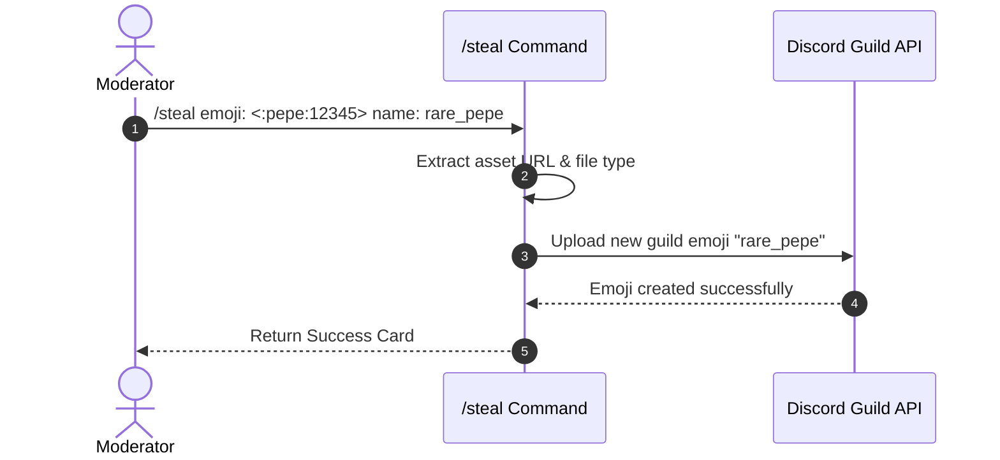

# ⚙️ Utility Addons

<p align="center">
  
  
  
</p>

> **Essential server utility suite featuring custom emoji stealing and auto-translation.**

---

## 🌟 Overview

The **Utility Addons** module bundles high-frequency server tools into one lightweight addon. It empowers administrators and members with custom emoji/sticker stealing capabilities and multi-language text translation.

---

## ✨ Features

- **Emoji & Sticker Stealer (`/steal`)**:
  - Steals custom animated or static emojis from messages, image URLs, or raw input.
  - Automatically uploads custom stickers directly to your server.
  - Supports custom naming and permission validation (**Manage Emojis and Stickers**).
- **Multi-Language Translator (`/translate`)**:
  - Automatically detects source language from input text.
  - Translates text into target languages (e.g., English, Spanish, French, German, Japanese).
  - Formats results into clean, readable card outputs.

---

## 📥 Installation & Activation

Install the addon via Lumi's dynamic downloader:

```bash
# Download and activate utility addons
,download lumi-addons utility
```

---

## ⚙️ Configuration Options

Utility commands operate dynamically based on user inputs and Discord role permissions:

| Utility Feature | Required Permission | Description |
| :--- | :--- | :--- |
| `/steal` | **Manage Emojis and Stickers** | Requires bot and user permissions to upload custom emojis. |
| `/translate` | *None* | Available to all server members. |

---

## 💻 Commands & Usage

| Command | Option | Type | Description |
| :--- | :--- | :--- | :--- |
| `/steal` | `emoji` | `String` | Raw custom emoji or emoji URL to steal into the server. |
| `/steal` | `name` | `String` | *(Optional)* Custom name for the newly created emoji/sticker. |
| `/translate` | `text` | `String` | Text string to translate. |
| `/translate` | `target` | `String` | Target language code or language name (e.g. `es`, `fr`, `Japanese`). |

---

## 📡 Events & Listeners

- **Command Handlers**:
  - `commands/steal.ts`: Parses emoji payload, validates dimensions/format, and posts payload to Discord API.
  - `commands/translate.ts`: Interfaces with translation services and returns card embeds.
- **GDPR Standard**:
  `deleteUserData(userId)` is a documented no-op as this module does not store any user data.

---

## 🎨 Code Examples

### Emoji Stealing Workflow



### Translate Command Usage Example

```bash
# Slash command invocation
/translate text:"Bonjour tout le monde!" target:"en"
```
